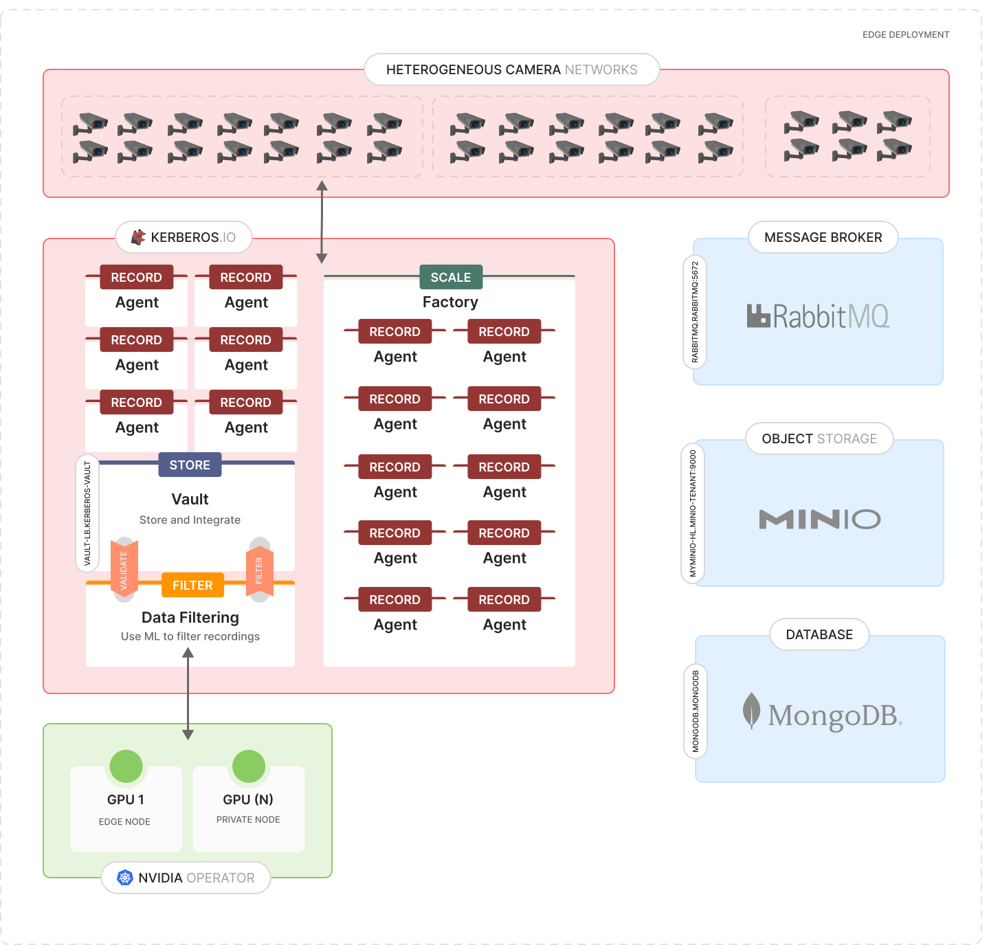
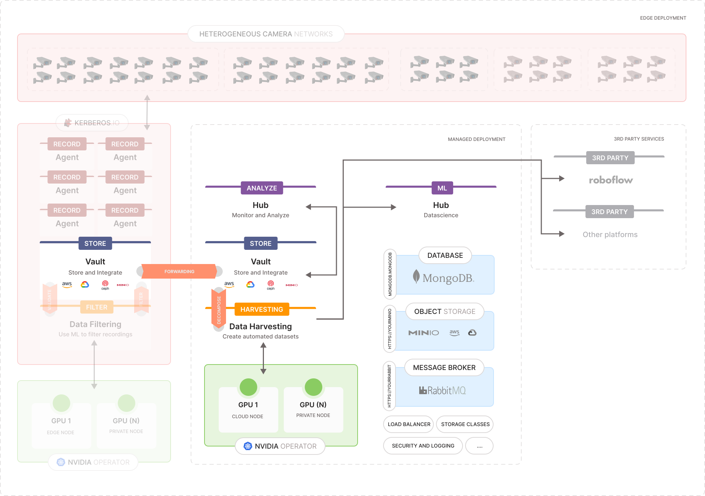

# Deployment

Deploying the Kerberos.io stack may initially appear to be a complex task due to its design for scalability from the outset. This entails the integration of several scalable components within a distributed deployment architecture. To streamline the installation process, we have established this repository to offer comprehensive guidance. Our objective is to incorporate as much automation as possible within this repository, thereby ensuring that the installation process is straightforward and user-friendly. At the same time, we remain committed to delivering a scalable and highly available video surveillance system.

## Continiuous deployment

This repository continuously tests the Kerberos.io deployment using GitHub Actions across various platforms. Refer to the badges for an overview of the operating systems and Kubernetes distributions we are deploying to. We welcome suggestions for additional automations to consider.

## Architecture

As previously indicated, several integral components, including Object Storage, Database, and Message Brokers, are deployed and configured to ensure the proper functionality of Kerberos.io. The architecture diagrams below aims to provide a visual representation of these components and their interactions with one another depending the deployment; self-hosted or managed cloud deployment.

It is important to note that the ease of installation may vary depending on the chosen Kubernetes distribution and platform. For instance, distributions like Microk8s, which offer an addons feature, may simplify the installation process significantly. Managed Kubernetes services on platforms such as AWS, Azure, GCP, and others offer a range of supplementary services. These include, but are not limited to, cloud-based object storage, load balancers, persistent volumes, and additional resources that enhance the deployment experience. On the other hand running a self-hosted vanilla Kubernetes deployment will come with additinal work as it misses the out-of-the-box components from a managed deployment or the self-hosted Microk8s add-ons feature.

Given these differences, we have created specific architectural frameworks for self-hosted and cloud-based deployments. This approach ensures that each deployment is optimized for its environment, using the unique benefits and services of each platform. In the next section we discuss the different deployment strategies and installation processes.

## Self-hosted deployment

Self-hosted deployments are typically used for camera processing and edge storage. In this setup, Kerberos Agents are deployed and connected to cameras, with recordings stored in the Kerberos Vault. Additionally, you may want to create integrations, such as [data filtering](https://github.com/uug-ai/data-filtering), to ensure only relevant recordings are retained, or set up custom notifications to your first or third-party platforms. In this edge scenario, hardware is being deployed in the local network to handle the workloads; for example AMD64 or ARM64 processors.

A key aspect of this deployment is the scaling of Kerberos Agents. Each camera is assigned a dedicated Kerberos Agent container, which is linked to a central Kerberos Vault. The Kerberos Vault stores metadata in MongoDB, recordings in Minio (or another S3-compliant object storage), and can generate events in a message broker like RabbitMQ. This approach enables you to develop custom applications/logic that can respond to the creation of new recordings.

Based on your technology experience and preferences, you can choose from the following deployment guides:

- [[Easy] Install Kerberos.io on Docker](/README.docker.md)
- [[Medium] Install Kerberos.io on Microk8s](/README.microk8s.md)
- [[Advanced] Install Kerberos.io on Kubernetes](/README.k8s.md)

## Managed deployment

Managed deployments are typically executed on cloud platforms such as Azure, Google Cloud Platform (GCP), Amazon Web Services (AWS), among others. The advantage of a managed deployment is that many foundational components are pre-configured and readily available, which is not the case for a self-hosted deployment. For example:

- Object storage: AWS has S3, GCP has Cloud Storage, Azure has Blob Storage.
- Load Balancers: Automatic traffic distribution for high availability.
- Encryption: Built-in data encryption at rest and in transit.
- High availability and scaling: can allocate new compute and storage on the fly.
- etc.

As previously discussed, a managed deployment enhances resilience and high availability by leveraging the cloud provider's existing services as the backbone for your Kubernetes cluster. For example, when deploying a Kubernetes cluster on:

- AWS provides EKS (Elastic Kubernetes Service) which integrates with services like S3 for object storage, EC2 for compute instances, IAM for access management, CloudWatch for monitoring, and RDS for managed databases.
- GCP provides GKE (Google Kubernetes Engine) which utilizes Google Cloud Storage for object storage, Compute Engine for virtual machines, IAM for access control, Stackdriver for monitoring and logging, and Cloud SQL for managed databases.
- Azure provides AKS (Azure Kubernetes Service) which works with Azure Blob Storage for object storage, Virtual Machines for compute resources, Azure Active Directory for identity management, Azure Monitor for monitoring and diagnostics, and Azure SQL Database for managed relational databases.

Based on your technology experience and preferences, you can choose from the following deployment guides:

- [[Medium] Install Kerberos.io on Kubernetes](/README.k8s-managed.md)
