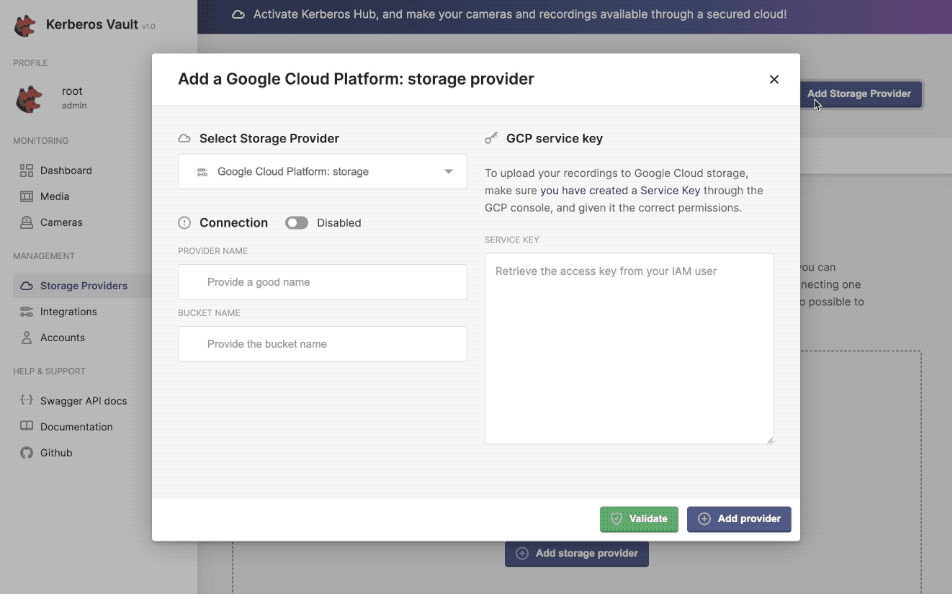

# Deployment on Microk8s

⏱️ **Time:** installation within 25min

💻 **Environment:** tested on Ubuntu 20.04 LTS, 22.04 LTS, 24.04 LTS

[](https://github.com/kerberos-io/deployment/actions/workflows/microk8s.yaml)

---

MicroK8s is a lightweight, fast, and secure Kubernetes distribution designed for developers and edge computing use cases. Developed by Canonical, MicroK8s is a minimalistic version of Kubernetes that can be installed with a single command and runs on various platforms, including Linux, macOS, and Windows. It is ideal for local development, CI/CD pipelines, IoT, and edge deployments due to its small footprint and ease of use. MicroK8s includes essential Kubernetes components and add-ons, such as DNS, storage, and the Kubernetes dashboard, making it a convenient choice for both beginners and experienced Kubernetes users.

In this tutorial, we will guide you through the installation of the complete stack, which includes the Agent, Factory, Vault, and Hub. This setup enables the storage of recordings from multiple cameras at the edge, facilitating local data processing and ensuring secure and efficient management of video streams.

## Install Microk8s

To install MicroK8s on your system, follow these steps. First, ensure that you have `snapd` installed on your machine. If not, you can install it using the following command:

To install MicroK8s on your system, follow these steps.

1. **Ensure that you have `snapd` installed on your machine.**
   If not, you can install it using the following command:

   ```bash
   sudo apt update
   sudo apt install snapd
   ```

2. Install MicroK8s. Once snapd is installed, you can install MicroK8s with:

   ```bash
   sudo snap install microk8s --classic --channel=1.32/stable
   ```

3. Add your user to the microk8s group. This step is necessary to avoid using sudo for MicroK8s commands:

   ```bash
   sudo usermod -a -G microk8s $USER
   sudo chown -f -R $USER ~/.kube
   ```

4. Apply the new group membership. You need to re-enter your session for the group change to take effect:

   ```bash
   su - $USER
   ```

5. Check the status of MicroK8s. Ensure that MicroK8s is running correctly:

   ```bash
   microk8s status --wait-ready
   ```

6. Add an alias for kubectl as microk8s:

To simplify the usage of `kubectl` with MicroK8s, you can create an alias. This allows you to use the `kubectl` command without needing to prefix it with `microk8s.` every time. Add the following line to your shell configuration file (e.g., `.bashrc`, `.zshrc`):

```sh
alias kubectl='microk8s kubectl'
alias helm='microk8s helm'
```

or use the `snap` command:

```sh
sudo snap alias microk8s.kubectl kubectl
sudo snap alias microk8s.helm helm
```

For more detailed instructions and troubleshooting, please refer to the official MicroK8s documentation.

## Dependencies

Before installing, several dependencies are required for storage, such as a database (e.g., MongoDB) and a message broker (e.g., RabbitMQ) for asynchronous behavior. We will install these components before setting up the Kerberos Agents and Kerberos Vault.

One of the key advantages of MicroK8s is its out-of-the-box addons, which can be enabled with a single command. This eliminates the need for complex Helm charts or operators, simplifying the setup process. We will enable some common services, such as DNS, GPU support, and storage, to streamline the installation.

```bash
microk8s enable dns
microk8s enable dashboard
microk8s enable nvidia
microk8s enable hostpath-storage
```

You can verify the status of the enabled addons by running the following command:

```sh
microk8s.status
```

Or view the pod status with:

```bash
kubectl get po -w -A
```

### Clone repository

Next, we will clone this repository to our local environment. This will allow us to execute the necessary configuration files for installing the Minio operator, MongoDB Helm chart, and other required components.

```bash
git clone https://github.com/kerberos-io/deployment
cd deployment
```

### Object storage: MinIO

MinIO is a high-performance, distributed object storage system that is compatible with Amazon S3 cloud storage service. It is designed to handle large-scale data storage and retrieval, making it an ideal choice for modern cloud-native applications.

MinIO will be used to store recordings from the Agents. These recordings are crucial for surveillance and monitoring purposes, and having a reliable storage solution like MinIO ensures that the data is stored securely and can be accessed efficiently.

```bash
git clone --depth 1 --branch v6.0.1 https://github.com/minio/operator.git && kubectl apply -k operator/
```

View the minio operator status with:

```bash
kubectl get po -w -A
```

Next we'll create a tenant

```bash
sed -i 's/openebs-hostpath/microk8s-hostpath/g' ./minio-tenant-base.yaml
kubectl apply -f minio-tenant-base.yaml
```

View the minio tenant status with:

```bash
kubectl get po -w -A
```

You should see the `myminio` tenant being created

```bash
minio-tenant   myminio-pool-0-0       2/2     Running   0       60s
```

We create a bucket in the minio tenant

You might need to install the minio client if not yet available.

```bash
curl https://dl.min.io/client/mc/release/linux-amd64/mc \
  --create-dirs \
  -o $HOME/minio-binaries/mc

chmod +x $HOME/minio-binaries/mc
export PATH=$PATH:$HOME/minio-binaries/
```

Expose the minio service so we can reach it from our local station.

```bash
kubectl port-forward svc/myminio-hl 9000 -n minio-tenant &
```

Create the `mybucket` bucket in the `myminio` tenant.

```bash
mc alias set myminio http://localhost:9000 minio minio123 --insecure
mc mb myminio/mybucket --insecure
```

Close the port-forward

```bash
pkill -f "port-forward"
```

The expected output should resemble the following:

```bash
root@microk8s:~/deployment# mc mb myminio/mybucket --insecure
Handling connection for 9000
Bucket created successfully `myminio/mybucket`.
```

or if not possible we will access the minio console using a reverse tunnel.

```bash
kubectl port-forward svc/myminio-console -n minio-tenant 8080:9090
ssh -L 8080:localhost:8080 youruser@x.x.x.x
```

To access the application, open your browser and navigate to `localhost:8080`. Use the credentials specified in the `minio-tenant-base.yaml` configuration file to log in. Once logged in, you can create a new bucket, such as `mybucket`, or choose a name of your preference.

### Database: MongoDB

When using Vault, it will persist references to the recordings stored in your storage provider in a MongoDB database. As used before, we are using `helm` to install MongoDB in our Kubernetes cluster. Within the Kerberos Vault project we are using the latest official mongodb driver, so we support all major MongoDB versions (4.x, 5.x, 6.x, 7.x).

Have a look into the `./mongodb-values.yaml` file, you will find plenty of configurations for the MongoDB helm chart. To change the username and password of the MongoDB instance, go ahead and [find the attribute where](https://github.com/kerberos-io/vault/blob/master/kubernetes/mongodb/values.yaml#L148) you can change the root password. Please note that we are using the official [Bitnami Mongodb helm chart](https://github.com/bitnami/charts/tree/main/bitnami/mongodb), so please use their repository for more indepth configuration.

Next to that you might also consider a SaaS MongoDB deployment using MongoDB Atlas or using a managed cloud like AWS, GCP, Azure or Alibaba cloud. A managed service takes away a lot of management and maintenance from your side (backups, security, sharing, etc). If you do want to install MongoDB in your own cluster then please continue with this tutorial.

```bash
helm repo add bitnami https://charts.bitnami.com/bitnami
kubectl create namespace mongodb
```

Note: If you are installing a self-hosted Kubernetes cluster, we recommend using `openebs`. Therefore make sure to uncomment the `global`.`storageClass` attribute, and make sure it's using `microk8s-hostpath` instead.

```bash
sed -i 's/openebs-hostpath/microk8s-hostpath/g' ./mongodb-values.yaml
helm install mongodb -n mongodb bitnami/mongodb --values ./mongodb-values.yaml
```

Or after updating the `./mongodb-values.yaml` file again

```bash
helm upgrade mongodb -n mongodb bitnami/mongodb --values ./mongodb-values.yaml
```

View the MongoDB status and wait until it's properly running

```bash
kubectl get po -w -A
```

### Message broker: RabbitMQ

Now we can store recordings in `MinIO` and metadata in `MongoDB`. The remaining task is to store events in a message broker such as `RabbitMQ`. This setup enables an asynchronous event-driven approach, allowing you to receive real-time event each time a recording is uploaded. By doing so, you can develop custom logic and abstract the camera network from your machine learning models or computer vision algorithms. The primary focus is on the recordings, not the complex camera infrastructure.

```bash
kubectl create namespace rabbitmq
```

```bash
sed -i 's/openebs-hostpath/microk8s-hostpath/g' ./rabbitmq-values.yaml
helm install rabbitmq bitnami/rabbitmq -n rabbitmq -f rabbitmq-values.yaml
```

View the RabbitMQ status and wait until it's properly running

```bash
kubectl get po -w -A
```

### Vault

Vault requires a configuration to connect to the MongoDB instance. To handle this a `configmap` is defined in the `./mongodb-configmap.yaml` file. Modify the MongoDB credentials in the `./mongodb-configmap.yaml` file, and make sure they match the credentials of your MongoDB instance, as described above. There are two ways of configuring the MongoDB connection, either you provide a `MONGODB_URI` or you specify the individual variables `MONGODB_USERNAME`, `MONGODB_PASSWORD`, etc.

As mentioned above a managed MongoDB is easier to setup and manage, for example for MongoDB Atlas, you will get a MongoDB URI in the form of `"mongodb+srv://xx:xx@kerberos-hub.xxx.mongodb.net/?retryWrites=true&w=majority&appName=xxx"`. By applying this value into the `MONGODB_URI` field, you will have setup your MongoDB connection successfully.

```yaml
- name: MONGODB_URI
  value: "mongodb+srv://xx:xx@kerberos-hub.xxx.mongodb.net/?retryWrites=true&w=majority&appName=xxx"
```

Once you applied this value, the other values like `MONGODB_USERNAME`, `MONGODB_PASSWORD` and others will be ignored. If you don't like the `MONGODB_URI` format you can still use the old way of defining the MongoDB connection by providing the different values.

```yaml
    - name: MONGODB_USERNAME
      value: "root"
    - name: MONGODB_PASSWORD
->    value: "yourmongodbpassword"
```

Create the `kerberos-vault` namespace.

```bash
kubectl create namespace kerberos-vault
```

Apply the manifest, so the Vault application is deployed and knows how to connect to the MongoDB.

```bash
kubectl apply -f ./mongodb-configmap.yaml -n kerberos-vault
kubectl apply -f ./kerberos-vault-deployment.yaml -n kerberos-vault
kubectl apply -f ./kerberos-vault-service.yaml -n kerberos-vault
```

Verify if the pod is running

```bash
kubectl get po -w -A
```

#### Access the UI

If you have opted for the `NodePort` configuration, you can access the Vault via the `http://localhost:30080` endpoint in your browser. For server installations without a GUI, consider setting up a reverse proxy to enable browser access from your local machine. Alternatively, you may utilize a `LoadBalancer` if one is available or if you are deploying on a managed Kubernetes service.

```bash
ssh -L 8080:localhost:30080 user@server-ip -p 22
```

#### Login to Vault

Once you have access to the Vault user interface, you should be able to login with a username and password. You will [find the username and password here](https://github.com/kerberos-io/deployment/blob/main/kerberos-vault-deployment.yaml#L36-L39).

- Username: [**view username**](https://github.com/kerberos-io/deployment/blob/main/kerberos-vault-deployment.yaml#L36-L37)
- Password: [**view password**](https://github.com/kerberos-io/deployment/blob/main/kerberos-vault-deployment.yaml#L38-L39)

#### Configure the Vault

With the Vault installed, we can proceed to configure the various components. Currently, this must be done through the Vault UI, but we plan to make it configurable via environment variables, eliminating the need for manual UI configurations.



- Navigate to the `Storage Providers` menu and select the (+ Add Storage Provider) button. A modal will appear where you can input the required details. After entering the information, click the "Verify" button to ensure the configuration is valid. Once you receive a "Configuration is valid and working" message, click the "Add Storage Provider" button to complete the process. **_(!You are advised to generate more complex access and secret key for Minio, this is just for demo purposes, do not use this in production)_**

  - Minio
    - Enabled: true
    - Provider name: minio
    - Bucket name: mybucket
    - Region: na
    - Hostname: myminio-hl.minio-tenant:9000
    - Access key: minio
    - Secret key: minio123

- Navigate to the `Integrations` menu and select the (+ Add Integration) button. A modal will appear where you can input the required details. After entering the information, click the "Verify" button to ensure the configuration is valid. Once you receive a "Configuration is valid and working" message, click the "Add Integration" button to complete the process. **_(!You are advised to generate more complex username and password for RabbitMQ, this is just for demo purposes, do not use this in production)_**

  - RabbitMQ
    - Enabled: true
    - Integration name: rabbitmq
    - Broker: rabbitmq.rabbitmq:5672
    - Exchange: <empty>
    - Queue: data-filtering
    - Username: yourusername
    - Password: yourpassword

- Navigate to the `Accounts` menu and click the (+ Add Account) button. A modal will appear where you can input the required details. After entering the information, click the "Add Account" button to complete the process.

  - Enabled: true
  - Account name: myaccount
  - Main provider: minio
  - Day limit: 30
  - Integration: rabbitmq
  - Directory: \*
  - Access key: XJoi2@bgSOvOYBy# (or generate new keys, but don't forget to update them in the next steps)
  - Secret key: OGGqat4lXRpL@9XBYc8FUaId@5 (or generate new keys, but don't forget to update them in the next steps)

### Create a Agent

After deploying the Vault and configuring the necessary services for storage, database, and integration, you can proceed to deploy the Agent with the appropriate configuration. Review the `kerberos-agent-deployment.yaml` file and adjust the relevant settings, such as the RTSP URL, to ensure proper functionality. Please note that you can allow opt for the [Kerberos Factory](https://github.com/kerberos-io/factory/tree/master/kubernetes) which gives you a UI to manage the creation of Agents. Also please note if you generated new the keys in the previous Vault account creation, you need to update those in the Agent deployment.

```bash
kubectl apply -f kerberos-agent-deployment.yaml
```

Review the creation of the Agent and review the logs of the container to validate the Agent is able to connect to the IP camera, and if a recording is being created and transferred to the Vault

```bash
kubectl get po -w -A
kubectl logs -f kerberos-agent...
```

To validate the Vault and review any stored recordings, access the user interface at `http://localhost:30080` (after establishing the reverse tunnel).

### Create Agents through Factory

Managing Agents through seperate configuration files might feel cumbersome, especially for non-technical users. This is where Factory comes into the picture. Factory provides a visual view that allows you to rapidly connect cameras through a user interface, which allows users without any technical background about cameras and kubernetes create Agents.

Factory also requires a mongodb, just like Vault. Luckily you can reuse the MongoDB installation we have deployed earlier, the only thing we'll need to do is to create another `configmap.yaml` in the `kerberos-factory` namespace.

Create the `kerberos-factory` namespace.

```bash
kubectl create namespace kerberos-factory
```

Apply the manifests, so Factory is deployed and knows how to connect to the MongoDB.

```bash
kubectl apply -f ./mongodb-configmap.yaml -n kerberos-factory
kubectl apply -f ./kerberos-factory-deployment.yaml -n kerberos-factory
kubectl apply -f ./kerberos-factory-service.yaml -n kerberos-factory
```

To allow our Factory to create Kubernetes resources we will need to apply an additional cluster role. This will allow our Factory deployment to read and write resources to our Kubernetes cluster.

```bash
kubectl apply -f ./kerberos-factory-clusterrole.yaml -n kerberos-factory
```

Verify if the pod is running

```bash
kubectl get po -w -A
```

### Hub

Now we have setup the most important building blocks in terms of video surveillance: Agents or Factory and Vault, we can start consolidating our cameras and recorded videos into a single pane of glass also known as Hub.

```bash
helm repo add kerberos https://charts.kerberos.io
kubectl create namespace kerberos-hub
```

```bash
kubectl create -f https://raw.githubusercontent.com/prometheus-operator/prometheus-operator/master/bundle.yaml
```

```bash
helm install hub kerberos/hub -n kerberos-hub -f kerberos-hub-values.yaml
```

```bash
helm upgrade hub kerberos/hub -n kerberos-hub -f kerberos-hub-values.yaml
```

```bash
kubectl apply -f kerberos-hub-nodeports.yaml  -n kerberos-hub
```

```bash
kubectl apply -f kerberos-hub-create-database-job.yaml  -n kerberos-hub
```

## Cleanup

If you consider to remove the Kerberos.io stack you might just disable the microk8s installation

```bash
microk8s reset
sudo snap remove microk8s
```

or if you want to keep the microk8s installation you can also delete the individual deployments.

```bash
kubectl delete -f data-filtering-deployment.yaml
kubectl delete -f kerberos-agent-deployment.yaml
kubectl delete -f ./kerberos-vault-deployment.yaml -n kerberos-vault
kubectl delete -f ./mongodb-config.yaml -n kerberos-vault
helm del rabbitmq -n rabbitmq
helm del mongodb -n mongodb
git clone --depth 1 --branch v6.0.1 https://github.com/minio/operator.git && kubectl delete -k operator/
```

You can confirm all the workloads were removed from your system.

```bash
kubectl get po -w -A
```
